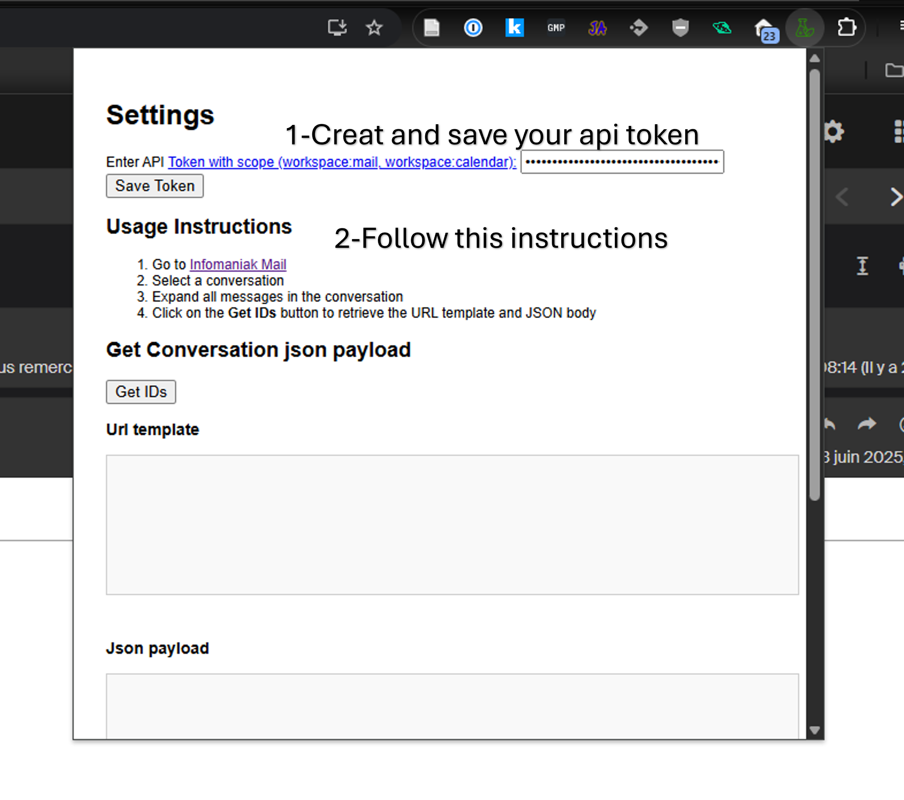
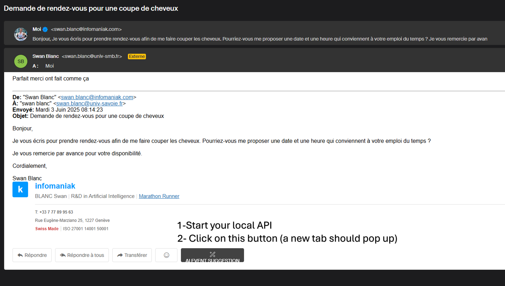

# Hackathon Starter Repo

This guide helps you get productive quickly during the hackathon. It covers:
- Installing and using uv (the Python package/environment manager used in this repo)
- Running the app in debug mode with debug.py
- Building and running with Docker
- Loading the Chrome extension in Developer Mode

**We make tutorial video to explain how to use this repo: [HERE](https://kdrive.infomaniak.com/app/share/100338/79e7f715-8efb-4475-b6df-ca2024b36ab7)**

---

## Prerequisites

- Python 3.13.x (the project targets Python 3.13.1)
- uv (package/env manager)
- Git
- Docker (optional, for containerized runs)
- Google Chrome (for the extension)
- Infomaniak AI Tools API
- Infomaniak KSuite mailbox

---

## Environment variables

You can use the .env.example file as a template for your .env file.

- Create an Infomaniak dev token to communicate with the AI Tools API (scope: `ai-tools`): https://manager.infomaniak.com/v3/28/ng/profile/user/token/list
- Create an Infomaniak KSuite mailbox API token (you can create one token with all the permissions in the previous step) with scopes: `workspace:mail, workspace:calendar`
- Get your AI Tools product ID: https://manager.infomaniak.com/v3/28/ng/products/cloud/ai-tools

Fill the .env file with your Infomaniak credentials.

---

## Install uv

uv is a fast Python package and environment manager. It will create and manage a virtual environment and install dependencies from pyproject.toml.

- macOS/Linux:
```
bash
# install uv
curl -LsSf https://astral.sh/uv/install.sh | sh

# ensure uv is on your PATH (you may need to restart the shell after install)
uv --version
```
- Windows (PowerShell):
```
powershell
# install uv
iwr https://astral.sh/uv/install.ps1 -UseBasicParsing | iex

# verify
uv --version
```
---

## Project setup with uv

1) Clone and enter the repo:
```
bash
git clone <YOUR-REPO-URL>.git
cd <YOUR-REPO-FOLDER>
```
2) Create a virtual environment and install dependencies:
```
bash
# create .venv (uv will pick a suitable Python; ensure 3.13.x is available)
uv venv

# install all dependencies from pyproject.toml (and lockfile if present)
uv sync
```
3) Add any new dependencies during the hackathon:
```
bash
# example: add FastAPI (replace with what you actually need)
uv add fastapi
```
4) Run Python scripts using the env:
```
bash
uv run python -V
uv run python mail.py
```
Tip: If you already have an activated venv (e.g., source .venv/bin/activate), you can also use python directly, but sticking to uv run avoids PATH issues.

---

## Running in debug mode (debug.py)

Use the provided debug entry point to run the app with verbose logging and any debug toggles your team uses.

- Basic run:
```
bash
uv run python debug.py
```
- With environment variables (example: toggle debug, set API host/port):
```
bash
# macOS/Linux
DEBUG=1 API_HOST=127.0.0.1 API_PORT=8000 uv run python debug.py
```

```
powershell
# Windows PowerShell
$env:DEBUG="1"; $env:API_HOST="127.0.0.1"; $env:API_PORT="8000"; uv run python debug.py
```
Common tips:
- If you see “Module not found” errors, run uv sync again.
- If debug.py expects a .env file, create one in the project root and rerun.

---

## Docker usage

If you prefer containerized runs (consistent environment across machines), use Docker.

- Build the image:
```
bash
docker build -t hackathon-app:local .
```
- Run the container:
```
bash
# Map your host port to the container’s app port (adjust 8000 if your app uses a different port)
docker run --rm -p 8000:8000 --env-file .env hackathon-app:local
```
- Run with inline env vars (no .env file):
```
bash
docker run --rm -p 8000:8000 -e DEBUG=1 -e API_HOST=0.0.0.0 -e API_PORT=8000 hackathon-app:local
```
- Rebuild after changes:
```
bash
docker build --no-cache -t hackathon-app:local .
```
Notes:
- If your app binds to 127.0.0.1 in the container, you may not be able to reach it from the host. Use 0.0.0.0 inside the container.
- If you mount code for live reload, you can add a volume:
```
bash
docker run --rm -p 8000:8000 -v "$PWD":/app hackathon-app:local
```
Make sure your Dockerfile has a WORKDIR /app and your app can reload (e.g., uvicorn --reload, etc.).

---

## Chrome Extension (Developer Mode)

Follow these steps to load the extension from source during development.

1) Open Chrome and go to:
- chrome://extensions

2) Enable “Developer mode” (toggle in the top-right).

3) Click “Load unpacked” and select the extension folder from this repo:
- This is typically the folder containing manifest.json.

4) Confirm the extension appears in the list:
- If it shows errors, click “Errors” to view details.
- Fix manifest.json issues (version compatibility, permissions) as needed.

5) Test: Get IDs
- Pin the extension to the toolbar via the puzzle icon.
- Open the extension popup or an options page if provided.
- For background logic, click “Service worker” under the extension card to open its console logs.
- Start the local API: `docker run --rm -p 8000:8000 --env-file .env hackathon-app:local`
- Go to your KSuite mailbox: https://ksuite.infomaniak.com/all/mail/0
- Open a mail thread conversation.
- Click the extension icon and the “Get IDs” button.



6) Updating after code changes:
- Press the “Refresh/Reload” button on the extension card in chrome://extensions.
- If you changed permissions or host permissions in manifest.json, Chrome may require you to accept new permissions.

7) Test: Event suggestion
- Create a dummy mail thread in your KSuite mailbox that discusses an event, then click “AI EVENT SUGGESTION” in the mail thread conversation.



---

## Suggested daily workflow

- Development:
```
bash
uv sync
uv run python debug.py
```
- Add a dependency:
```
bash
uv add <package-name>
```
- Run container for parity checks:
```
bash
docker build -t hackathon-app:local .
docker run --rm -p 8000:8000 hackathon-app:local
```
- Load or refresh the Chrome extension and verify it talks to the local API.

Good luck!
